# Guía de Usuario – Melodía

Bienvenido a **Melodía**.  
Preparamos esta guía para acompañarte en tus primeros pasos y ayudarte a aprovechar al máximo todo lo que la aplicación tiene para ofrecerte.  
La idea es que puedas moverte con comodidad, descubrir contenido y disfrutar de tu música sin complicaciones.

## Contenido
1. [Login y Registro](#lyr)  
   1. [Registro](#registro)  
   2. [Login](#login)  
2. [Inicio](#inicio)  
3. [Buscar](#buscar)  
4. [Tu biblioteca](#biblioteca)  
5. [Canciones](#canciones)  
6. [Playlists](#playlists)  
7. [Subir Contenido (Artistas)](#artistas)  
   1. [Subir Canción](#upSong)  
   2. [Subir Álbum](#upAlbum)
8. [Soporte](#Soporte)
---

## 1 - Login y Registro

Para comenzar a usar Melodía necesitás una cuenta.  
Podés iniciar sesión si ya tenés una o crear una nueva en unos pocos pasos.

### 1.1 - Registro

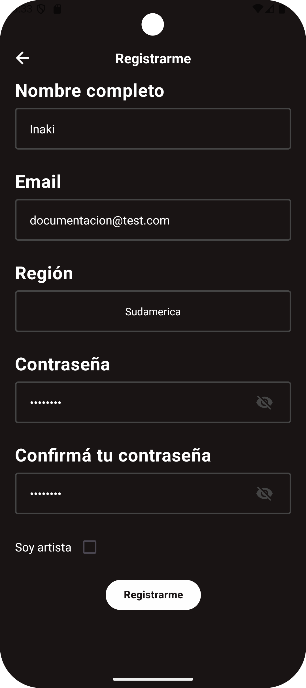

Al completar tus datos y finalizar el registro, te daremos la bienvenida con una breve selección de artistas y géneros para personalizar tu experiencia desde el primer día.

Requisitos de la contraseña:
* Más de 6 caracteres  
* Al menos un símbolo  
* Al menos un número  
* Al menos una mayúscula  

### 1.2 - Login

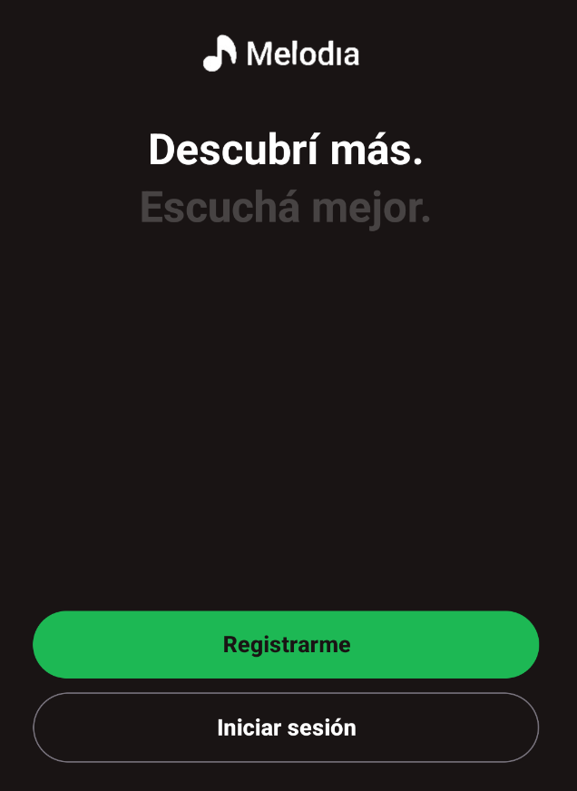

Si ya tenés una cuenta, simplemente ingresá tus datos para acceder a todo tu contenido.

---

## 2 - Inicio

Al entrar en la aplicación te vas a encontrar con cuatro secciones pensadas para que accedas rápido a lo que más usás.

### Buscador

Ideal para encontrar canciones, artistas, playlists o álbumes en cuestión de segundos.
Tip: empezá a escribir y Melodía te sugiere resultados mientras tipeás.

### Atajos
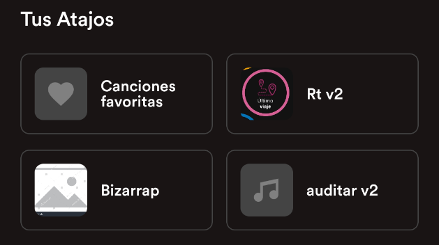

Un acceso directo al contenido que más te interesa.

### Novedades
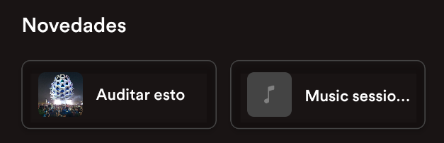

Acá vas a ver lo último que publicaron tus artistas preferidos, así no te perdés nada nuevo.

### Reproducciones recientes
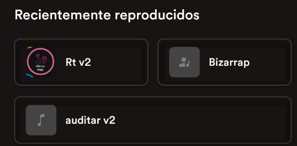

Te permite continuar con lo que estabas escuchando, sin necesidad de buscarlo de nuevo. Ideal para volver a ese tema que quedó sonando en tu cabeza.

---

## 3 - Buscar

La sección **Buscar** es el lugar para explorar todo el catálogo de Melodía.

Incluye accesos directos a:
* Canciones recientes  
* Álbumes recomendados  
* Géneros recomendados  

Si querés algo puntual, podés filtrar por género o escribir en el buscador.  
Los resultados incluyen canciones, playlists, artistas, usuarios, álbumes y géneros, y siempre se destaca un **Top Result** para ayudarte a encontrar lo más relevante.

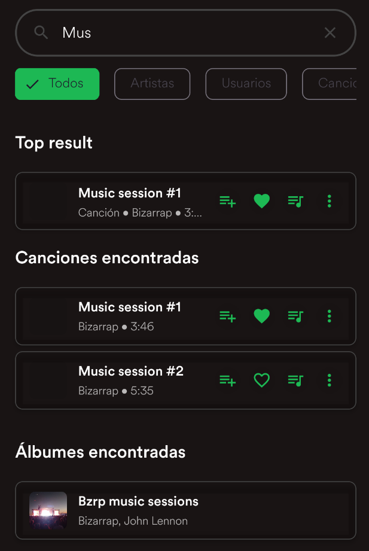

---

## 4 - Tu biblioteca

Tu biblioteca reúne todo lo que forma parte de tu experiencia en Melodía: tus playlists, artistas favoritos, álbumes guardados y más.

Es tu espacio personal para organizar y volver rápidamente a lo que más te gusta.
Consejo: mantené tus playlists con nombres claros (ej. “Running”, “Focus”) para encontrarlas más rápido.

---

## 5 - Canciones

En Melodía, las canciones son el centro de todo. Desde cada una de ellas podés acceder a distintas acciones:

1. Agregar a la cola  
2. Marcar como favorita  
3. Agregar a una playlist  
4. Abrir el menú contextual  

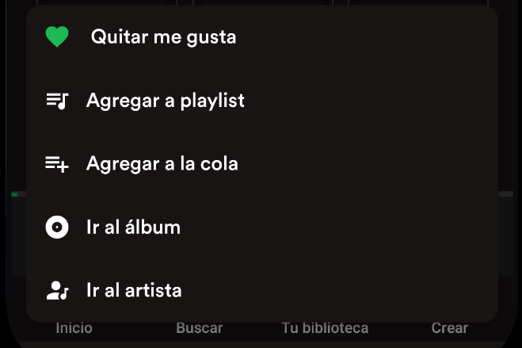

Aprovecha el menu contextual para llevar al maximo el control de tu experiencia musical.

Cada opción está pensada para que puedas interactuar con la música de la forma que prefieras.

---

## 6 - Playlists

Las playlists te permiten crear tu propio mundo musical.

Para crear una, seleccioná **Crear** y completá la información necesaria.

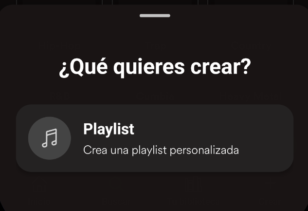

Luego podés sumar canciones, reorganizarlas, reproducir toda la lista o editarla cuando quieras.

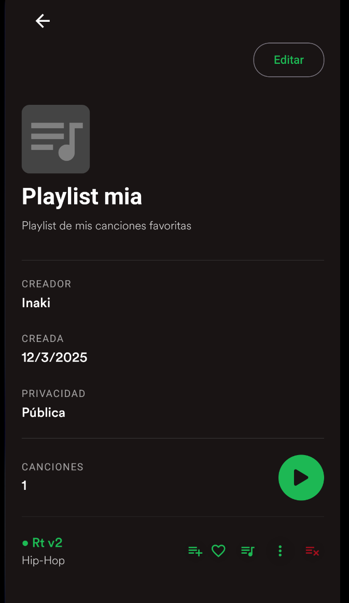

No solo eso, podes compartirla con el mundo al dejarla pública o mantenerla privada para tu uso personal.

---

## 7 - Solo para Artistas – Subir Contenido

Si sos artista, Melodía también es tu espacio para compartir lo que creás.

Melodía te brinda herramientas simples para publicar canciones y armar álbumes.

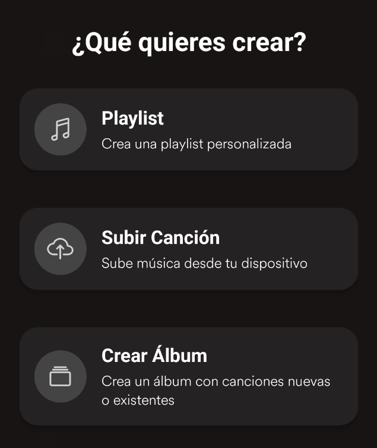

---

## 7.1 - Subir Canción

Podés subir tu música seleccionando un archivo y completando su información.
Seleccioná el archivo, completá los datos (título, género, créditos, etc.) y revisá la vista previa.

Elegí disponibilidad inmediata o programada para coordinar lanzamientos.

---

## 7.2 - Subir Álbum

Los álbumes permiten agrupar canciones tuyas, ya sean nuevas o ya existentes.

Usando canciones nuevas o existentes, organizá el tracklist y definí portada y descripción.

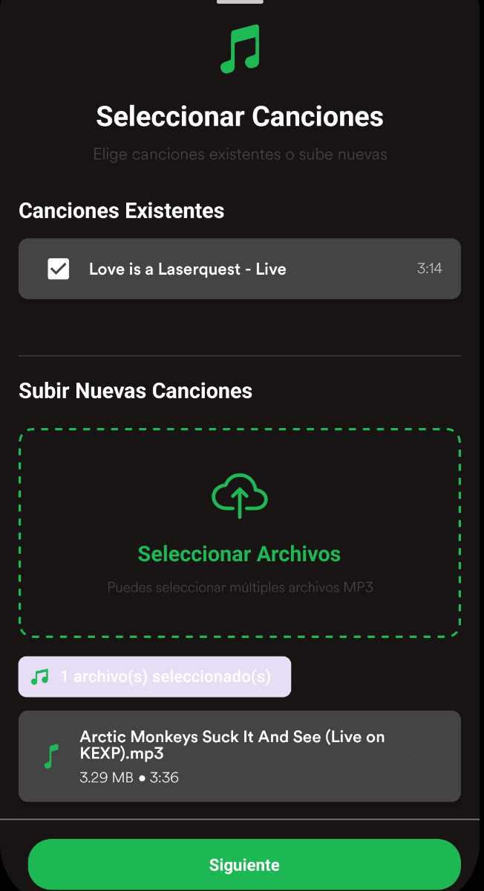

Además, podés sumar créditos para colaboradores y definir la fecha de publicación.

---

## 8 - Soporte

Si necesitás ayuda o tenés algún inconveniente, podés comunicarte con nuestro equipo escribiendo a:  
**mlardiez@fi.uba.ar**
