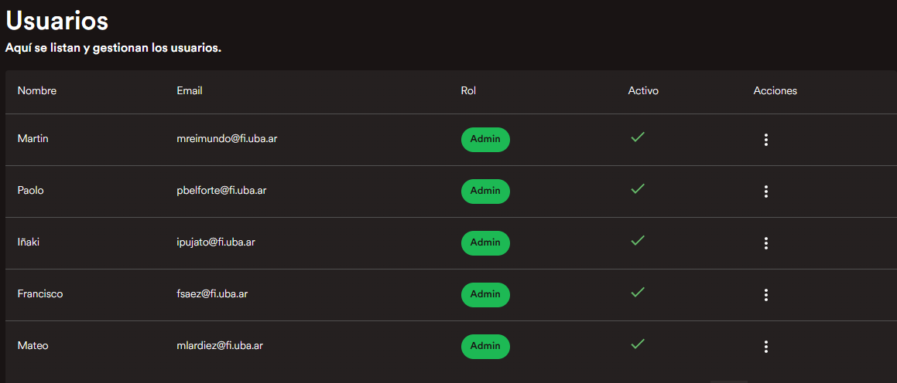
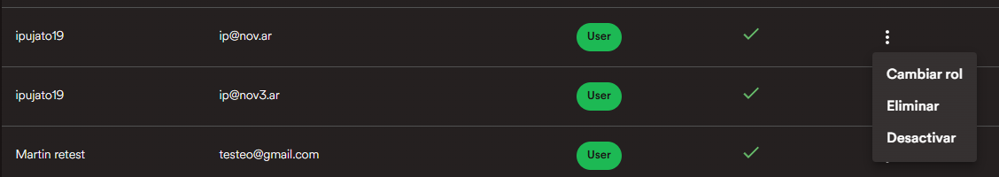
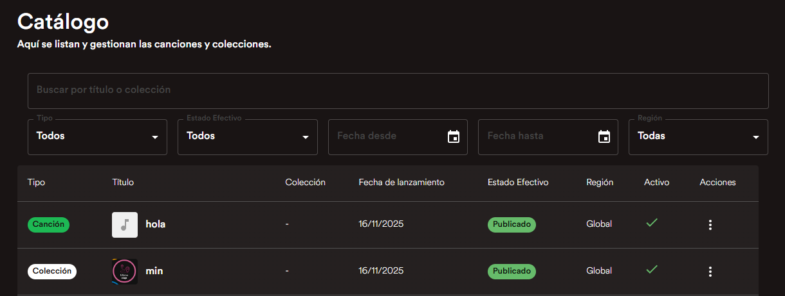
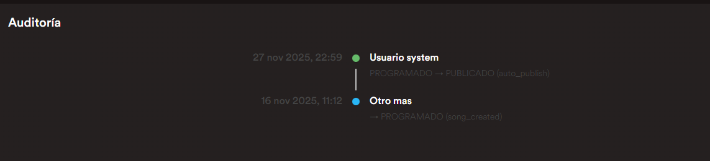
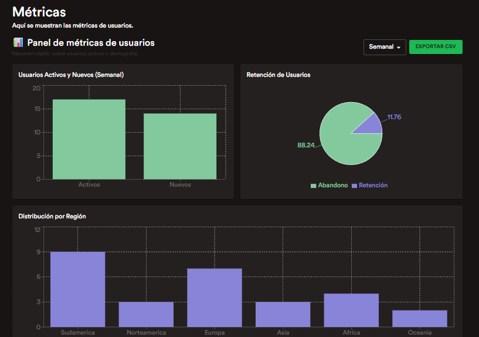

# Manual para admins - backoffice

En este archivo se va a explicar un poco del [backoffice de melodia](https://melodia-backoffice.pages.dev/). El objetivo es que sea una guía para administradores de la app

---

## Contenido

1. [Login](#login)
2. [Panel principal (Home)](#home)
3. [Lista de usuarios](#usuarios)
4. [Acciones sobre usuarios](#acciones-usuarios)
5. [Perfil de usuario](#perfil-usuario)
6. [Catálogo](#catalogo)
7. [Acciones del catálogo](#acciones-catalogo)
8. [Detalle de canción](#detalle-cancion)
9. [Auditoría](#auditoria)
10. [Métricas - Colecciones](#metricas-coleccion)
11. [Métricas - Canciones](#metricas-cancion)
12. [Métricas - Usuarios](#metricas-usuarios)
13. [Métricas - Artistas (vista general)](#metricas-artistas)
14. [Métricas - Artista (detalle)](#metricas-artista)

---

## 1 - Login
Para empezar, tenemos la pantalla de login. Simplemente hay que introducir las credenciales para entrar.

---

## 2 - Panel principal (Home)
Al entrar a la aplicación se redirige al home, donde los datos importantes se acceden a traves del navbar

---

## 3 - Lista de usuarios
En el primer link de Usuarios, se lleva a la página con un listado con todos los usuarios y datos principales de estos. Se pueden seleccionar para ver un detalle o dar a los 3 puntos para tomar acciones

---

## 4 - Acciones sobre usuarios
Aca podemos ver las acciones que se pueden tomar sobre un usuario, siendo estas Cambiar su rol al de un artista, elimnarlo o desactivarlo para que no pueda loguearse en la app

---

## 5 - Perfil de usuario
Al hacer click en un usuario, accedemos a su detalle con un poco de información adicional sobre este

---

## 6 - Catálogo
Luego, en la otra pestaña de catálogo tenemos un listado con canciones y colecciones, donde se puede buscar por el nombre, filtrar por tipo, estado, fecha y region

---

## 7 - Acciones del catálogo
Sobre cada elemento del catálogo se pueden tomar multiples acciones, como ver el detalle, las métricas, editarla, bloquearla o eliminarla

---

## 8 - Detalle de canción
Al ver el detalle de una canción vemos mas información sobre esta y adicionalmente podemos escuchar el audio asociado

---

## 9 - Auditoría
Un punto importante es la auditoría, aca vemos un historico de los cambios que se fueron efectuando sobre ese lanzamiento

---

## 10 - Métricas - Colecciones
Otra acción importante para ver son las métricas, ya que hay multiples KPIs que son de interes, como pueden ser las canciones de la colección, cuantas reproducciones tiene en total y el promedio

---

## 11 - Métricas - Canciones
Al hacer click en una de las barras de una colección tambien se puede acceder directamente a las métricas de una canción

---

## 12 - Métricas - Usuarios
En el próximo apartado de métricas de usuarios, tenemos datos relevantes como la retención de los usuarios (si es que tomaron acciones hace poco tiempo y tienen datos en su historial de reproducción), los usuarios nuevos que se crearon y los activos, ademas de la distribución por región. Todos los datos se pueden exportar en un csv para su futuro análisis

---

## 13 - Métricas - Artistas (vista general)
En el último apartado, tenemos las métricas de artistas, donde se listan los artistas por su nombre artístico si es que cuentan con este, si no por el de usuario.

---

## 14 - Métricas - Artista (detalle)
Al hacer click en un artista podemos acceder a su detalle y ver métricas de este, como seguidores, cuantos oyentes tuvo en el mes, de donde eran y demas datos de interes para el negocio

---

## Agradecimientos finales

El equipo de Melodia agradece su atención al leer este documento, y esperamos que sea un gran administrador de nuestra aplicación!

